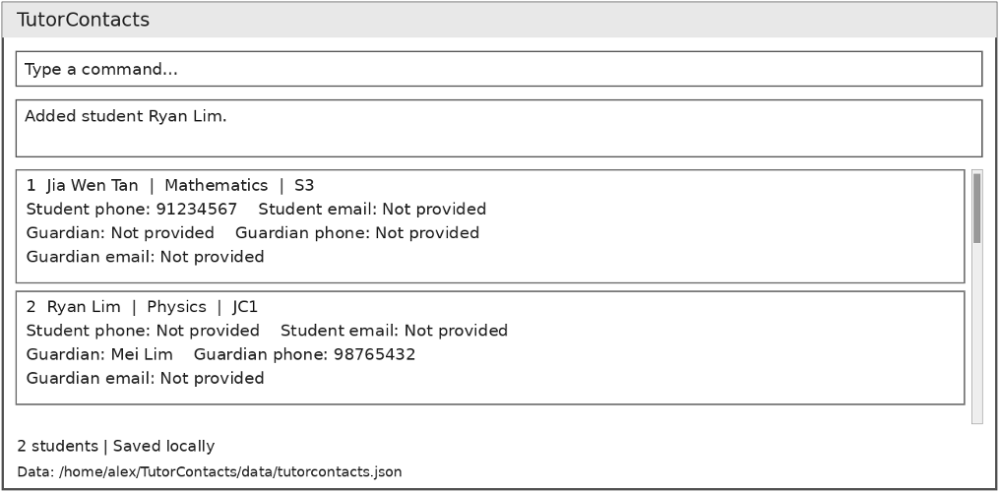

# TutorContacts

TutorContacts is a desktop application for independent private tutors to manage student and guardian contact details together with tutoring information such as subjects and education levels.

TutorContacts is optimized for users who prefer typing. Its command-line interface allows frequent contact-management tasks to be completed quickly using commands while retaining the convenience of a graphical interface.

For detailed documentation, see the [TutorContacts product website](https://ay2627s1-cs2103t-w10-3.github.io/tp/).

## Acknowledgements

This project is based on the AddressBook-Level3 project created by the [SE-EDU initiative](https://se-education.org).
