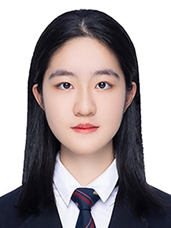
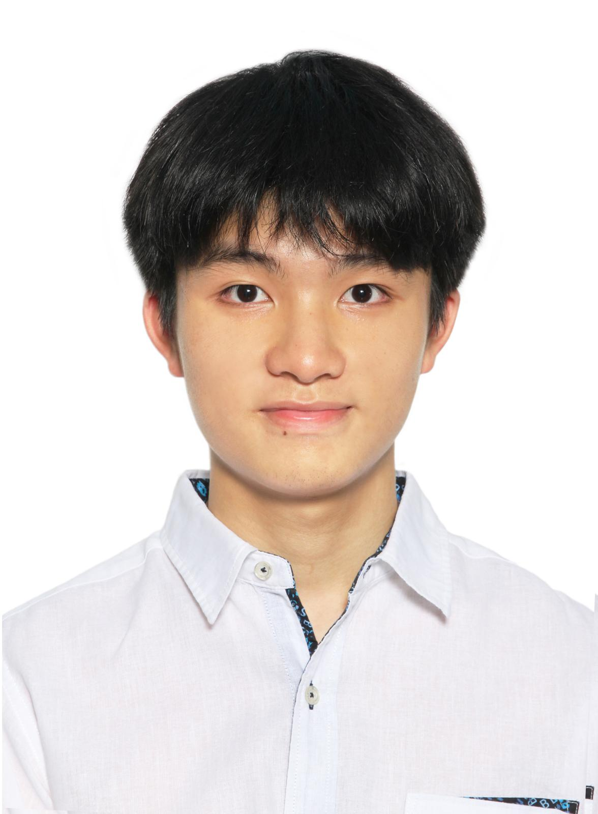
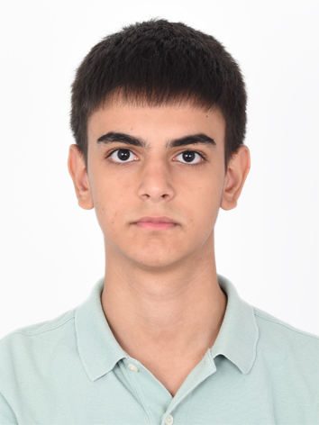

We are a team based in the [School of Computing, National University of Singapore](https://www.comp.nus.edu.sg).

You can reach us at the email `seer[at]comp.nus.edu.sg`

## Project team

### Zhai Jiayi

[[github](https://github.com/JiayiZhai)]

* Role: Developer
* Responsibilities: Implementing assigned features and reviewing pull requests

### Wang Yanrong

[[github](https://github.com/Yanrong-Wang)]

* Role: Developer
* Responsibilities: Documentation and testing

### Jane Doe
* Responsibilities: Scheduling and tracking; Integration

### Siu Lok Yin

[[github](https://github.com/bedrockfake)]

* Role: Developer
* Responsibilities: Deliverables and deadlines

### Aykhan Damirli

[[github](https://github.com/dmraykhan)]

* Role: Developer
* Responsibilities: Implementing assigned features and reviewing pull requests
